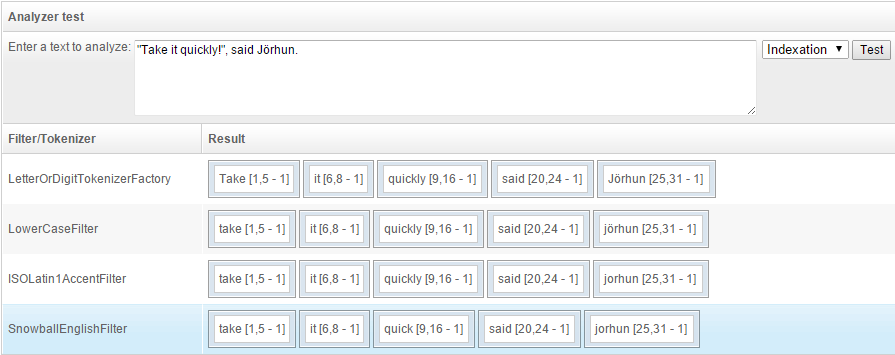

# Analyzers: what they can do for you is endless!

> August 21, 2014 - by Alexandre

Analyzers are a fascinating part of OpenSearchServer, **offering a wealth of features**.

They are responsible for processing text data both during indexation and when executing queries. They can:

*   **Split sentences into words**
*   **Apply regular expressions** on text
*   Filter words out
*   Enable the use of **synonyms**
*   Etc.
For example, here is how the sentence _'Take it quickly!', said Jörhun._ could be processed by analyzers before indexing:

Tokenizers, tokens, filters... you will soon be captivated!

Ready for awesomeness?! Read it all in our [Documentation center](http://www.opensearchserver.com/documentation/faq/indexing/how_to_use_analyzers.md).
