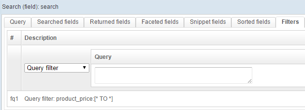

# Add filters to a query

> September 16, 2014 - by Séverine

Filters are necessary when using a search engine. OpenSearchServer offers several ways to add filters to a query.

For example, you want to:

* filter on **non-null values** in a specific field;
* filter on a **range of values**;
* filter on **numerical values**;
* filter on **several values** for one field;
* Etc.

Knowing how to work with filters is **very useful when configuring and testing an index**. To make this a snap, you can quickly add or remove any filter in the interface, via tab Query / Filters.

<!--more-->
For example requesting documents for which the "product_price" field is not empty is as simple as this:

Filters are also essential when **working with facets**: when a user **clicks on a facet, they are actually sending a filtered query** to OpenSearchServer.

Filters can easily be added to a query, using our REST API (an example can be found [on this page](http://www.opensearchserver.com/documentation/api_v2/searching_using_patterns/template_search.md)) or one of our clients (such as the [PHP Client](https://github.com/jaeksoft/opensearchserver-php-client#search-options)).

Discover the full article in our documentation center: [How to use filters on a query](http://www.opensearchserver.com/documentation/faq/querying/how_to_use_filters_on_query).
