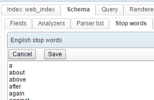

# Preventing insignificant words from being indexed

> August 25, 2014 - by Alexandre

When indexing data and running search queries, one usually wants to give a weight of zero to insignificant words such as “the”, “of”, etc.

The common solution offered by search engines is called “stop words”.

With OpenSearchServer, **managing and enabling a list of stop words is really simple**.

Here is how you can write this list in the interface:

And here is a demonstration of the process **applied by an analyzer** for the sentence “Bryan is in the kitchen”:

See how the StopFilter has parsed down the sentence to its significant words ?

You are of course free to use this feature for another purpose such as **filtering out swear words**. Since OpenSearchServer allows for creating multiple lists of stop words, you can apply different lists to different fields in the schema and use them separately in your queries!

Read more in [our Documentation center](http://www.opensearchserver.com/documentation/faq/indexing/how_to_set_up_stop_words.md).